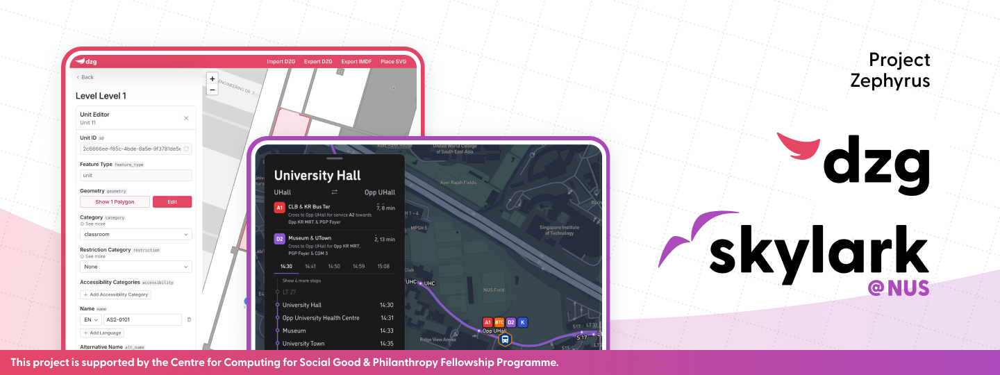

# Zephyrus

Project Zephyrus is a wayfinding project aimed at creating an interactive campus map for NUS, that includes both road-level navigation and indoors navigation.

The project consists of two web applications:

- [Skylark](./skylark/README.md), a user-facing interactive map progressive web app (PWA).
- [Dazzlegarden (dzg)](./dazzlegarden/README.md), an admin panel for editing and creating IMDF-standard indoor mapping files.

## Acknowledgements

This project is supported by the [Centre for Computing for Social Good & Philanthropy Fellowship Programme](https://www.ccsgp.comp.nus.edu.sg/fellowship-programme).