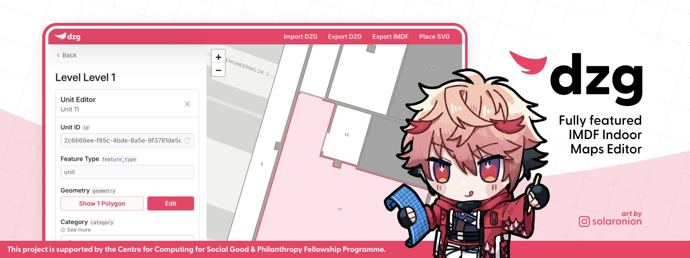

# Dazzlegarden

Dazzlegarden (dzg) is a IMDF indoor maps editor that aims to be fully compliant with [Apple's IMDF standard](https://register.apple.com/resources/imdf/). Dazzlegarden is part of [Project Zephyrus](../README.md), a wayfinding project for the National University of Singapore.

## Acknowledgements

Character design taken from NIJISANJI's [Seraph Dazzlegarden](https://www.nijisanji.jp/talents/l/seraph-dazzlegarden). Art by [@solaronion](https://instagram.com/solaronion).

This project is supported by the [Centre for Computing for Social Good & Philanthropy Fellowship Programme](https://www.ccsgp.comp.nus.edu.sg/fellowship-programme).
