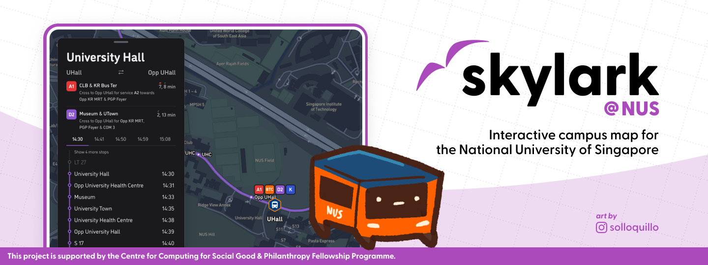

# skylark

Skylark is an interactive map for the National University of Singapore's Kent Ridge campus. Skylark is part of [Project Zephyrus](../README.md), a wayfinding project for the National University of Singapore.

## Acknowledgements

Character design and art by [@solloquillo](https://instagram.com/solloquillo).

The PWA was made using the [next-pwa-template](https://github.com/mvllow/next-pwa-template?tab=readme-ov-file). This project is supported by the [Centre for Computing for Social Good & Philanthropy Fellowship Programme](https://www.ccsgp.comp.nus.edu.sg/fellowship-programme).
